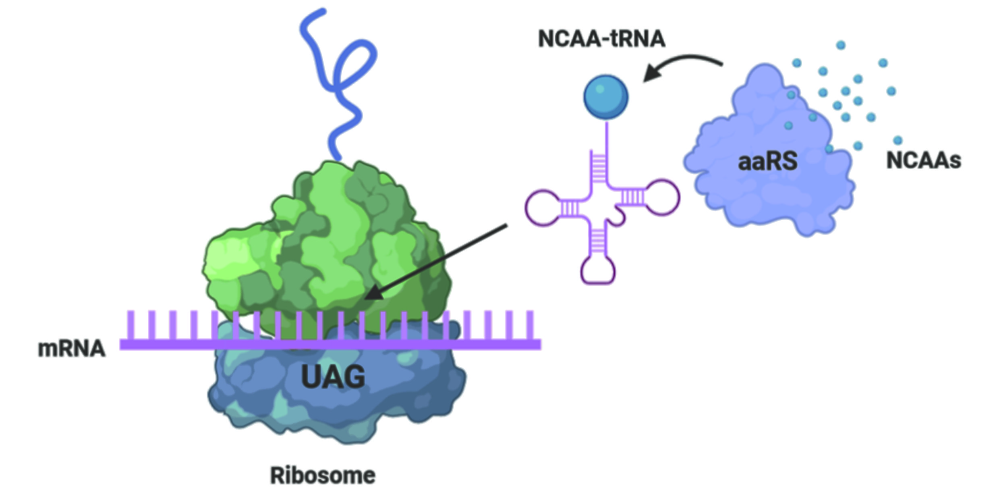
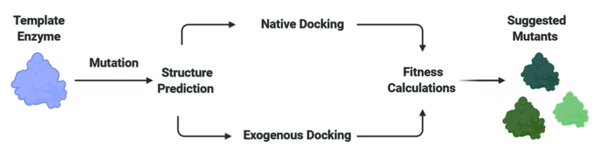

# An aaRS Engineering Pipeline 🧬

## A Scalable Pipeline for the Discovery of aaRS Mutants to Aid in Genetic Code Expansion.

## Introduction
Aminoacyl-tRNA Synthetases (aaRSs) are a class of enzyme central to translation,
facilitating the interaction of tRNAs to a cognate canonical amino acid (CAA).
To enable expansion of the natural chemical toolbox to encompass non-canonical
amino acids (NCAAs), new enzymes of this class have to be enginereed to accept
the alternative chemistries offered by NCAAs, while remaining inert to
pre-existing CAAs.



## Workflow
The engineering workflow facilitates structure prediction of mutant enzymes
through [Rosetta Cartesian](https://www.rosettacommons.org/docs/latest/cartesian-ddG) energy minimization, followed by blind docking of
native and target (exogenous) amino acids by [CB-Dock](http://clab.labshare.cn/cb-dock/php/).
Mutants are then scored for fitness using the Delta and RMSD metrics.



## Scoring
**Delta:**
* Measures enzyme engineered favourability as: `NCAA Dock Score - Native Dock Score`
* Lower the score, the greater the engineered affinity for the NCAA over the
native substrate\

**RMSD:**
* Estimation metric of the mutant producing a productive docking pose with the
target NCAA
* Root-Mean-Square Deviation of the exogenously docked NCAA to the crystal-structure
derived docking position of the native amino acid
* Lower the RMSD, the greater the mutant appears to dock the NCAA in a
productive binding pose.


## Quick Start
1. `git clone https://github.com/J-E-J-S/aaRS-pipeline`
2. `conda env create -f environment.yml`
3. `conda activate aaRS-pipeline`
4. `./aaRS-pipeline.sh -i -m -r`

## Usage
### Inputs
1. Create a `mutations.txt` file in the `/inputs/` directory\  
Must be in form:
```
X99 MNQ
Y100 MNQ
...
```
Where:
* X is the single-letter ID for the wild-type residue to be mutated
* The number '99' is the residue number of the mutable position
* MNQ is the pool of residues to be mutated at this position

2. Add the native and exogenous (target) amino acids to the `/inputs/` directory
* Amino acids have to be labelled as `nativeLigand.mol2` and `exogenousLigand.mol2` respectively
* Amino acids must be in `.mol2` standard
* The native amino acids must be taken from the known crystal structure of the template enzyme
    * This permits the RMSD calculation to estimate the productivity of the NCAA docking pose

3. Add the template enzyme `.pdb` file to the `/inputs/` directory
### Running the Pipeline
* To install the prerequisite scripts run the shell script with the `-i` option (this only has to be performed once)
`./aaRS-pipeline.sh -i `
* To prepare the mutational file system to begin pipeline flow, run the shell script with the `-m` option (this has to be performed for every new template enzyme or mutational context)    
`./aaRS-pipeline.sh -m`
* To begin the pipeline, run the shell script with the `-r` option  
`./aaRS-pipeline.sh -r` or run `nextflow run main.nf`
* To run pipeline from beginning to end as a new user, combine all options  
`./aaRS-pipeline.sh -i -m -r`
